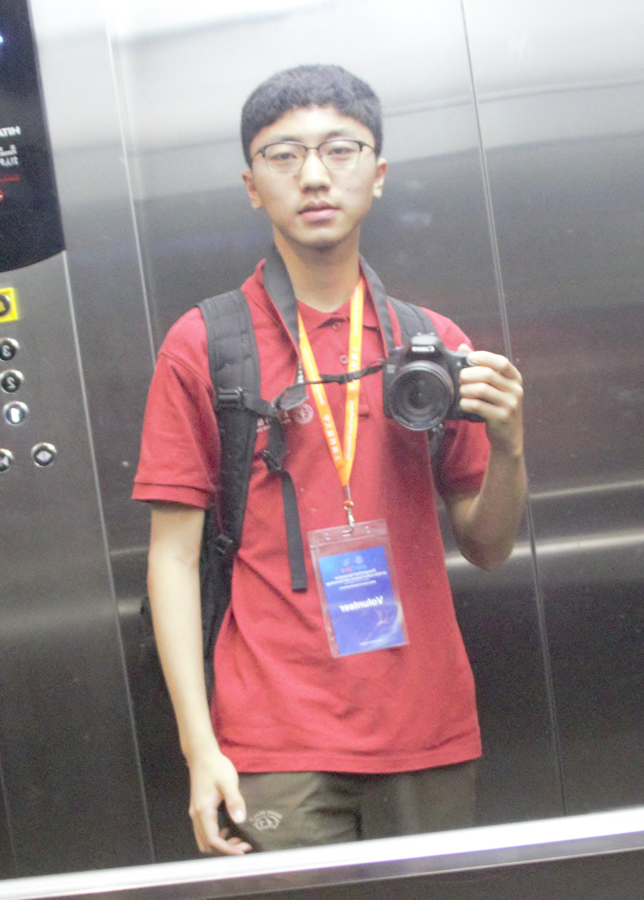

<b>Lab Visitors</b>

<b>Frenk van Harreveld</b> 

 
Frenk van Harreveld is an associate professor of social psychology at the University of Amsterdam. Subsequent to obtaining his PhD at the University of Amsterdam he worked for the world’s largest consulting firm Accenture, after which he returned to academia. He has worked as a visiting researcher at the University of California, Berkeley and the University of Massachusetts, Amherst and the University of British Columbia in Vancouver. His research concerns various aspects of uncertainty. Frenk’s research on attitudes and decision-making examines various forms of evaluative conflict such as attitudinal ambivalence, decision reversibility and regret. Other forms of uncertainty that he investigates are risk perception, lack of control and mortality salience. Frenk is Head of Studies at the Politics, Psychology, Law and Economics (PPLE) bachelor program of the University of Amsterdam and Strategic Research Program coordinator at the National Institute for Public Health and Safety.
  

<b>Matthew D. Rocklage</b> 

 
I'm a South Dakota native who earned my PhD in social psychology with a minor in statistics and quantitative methods at Ohio State University working with Dr. Russ Fazio. I'm currently a postdoctoral researcher of marketing at Northwestern University in the Kellogg School of Management.
  

<b>方雪 Xue Fang</b> 
化学 2015级本科 (Chemistry 2015) 

 
Xue is a fourth year student of school of physical science and technology in ShanghaiTech, major in chemistry, minor in innovation and entrepreneurship. Taking taekwondo, painting, piano and traveling as hobbies, Xue has a comprehensive background. Willing to challenge new field, also good at observing and analyzing details, she prefers to be an instructor in the future. Presently, she is working on educational psychology, habit formation and the recovery of failure, trying to develop a more effective education mode through research so as to help those who have trouble persisting on a task realize their goals.
  

<b>曾理 Li Zeng</b> 
计算机 2017级本科 (CS 2017) 

 
就读于上海科技大学信息科学与技术学院计算机科学与技术专业。热爱运动，擅长分析和计算。 理想是成为一名计算机科学领域研究人员。对社会心理学和人工智能有一定的兴趣，希望能在ARLab对相关课题做一定的研究，并积累自己的研究经验，锻炼研究能力。
  

<b>翁光源 Guangyuan (Gideon) Weng</b> 
计算机 2017级本科 (CS 2017) 

 
I’m an undergraduate student who is eager to comprehend the world. In addition to website and app development, I have a certain understanding of the visual art creation based on Processing. The application of machine learning in user behavior prediction and user value assessment also attracts me to a great extent.
  

