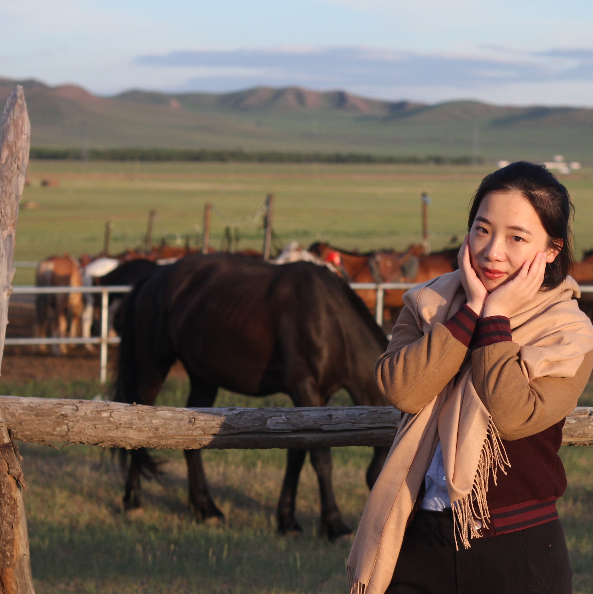
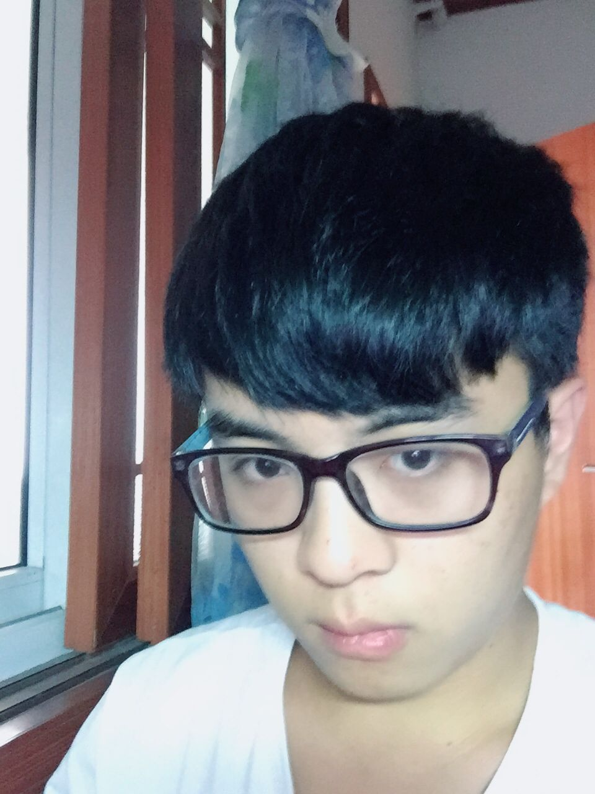
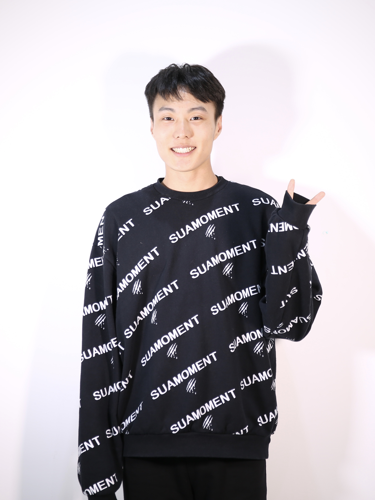
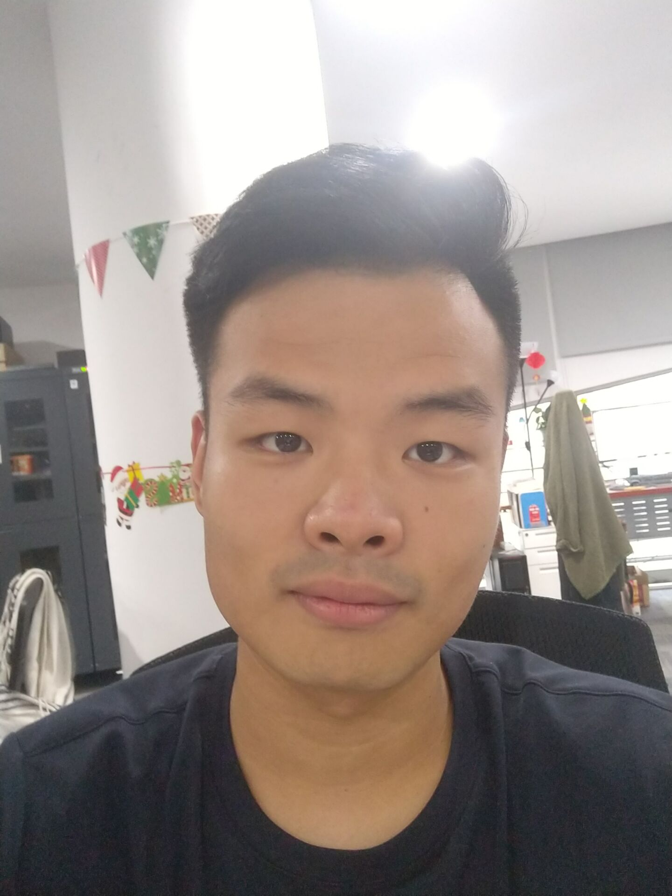
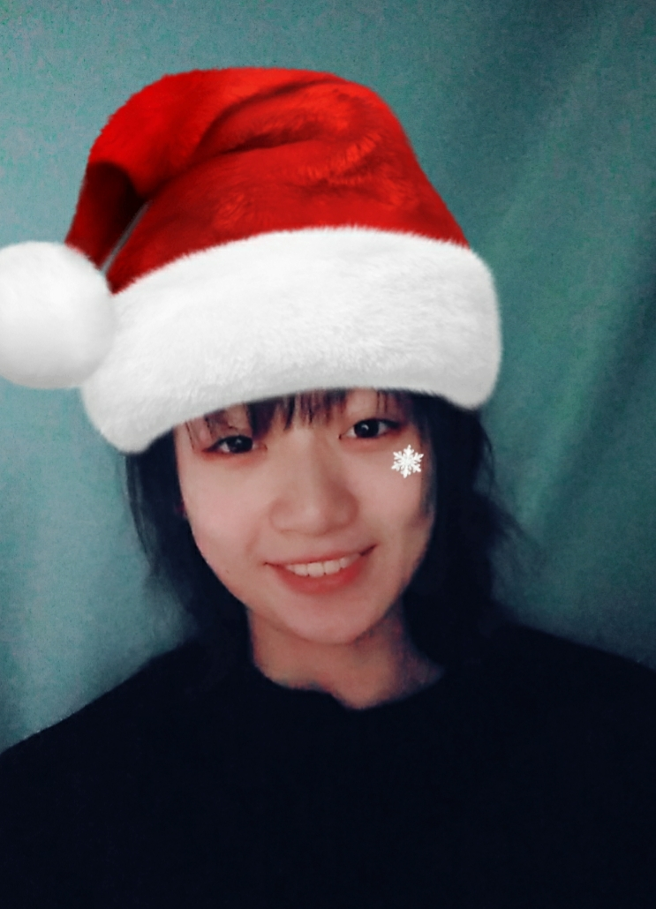

<b>Principle Investigator 研究员</b>

<b>杨丽凤 Lifeng Yang </b>
(PhD in Business Administration, The Ohio State University, USA) 

 
杨博士主要研究消费者行为心理学。杨博士的态度研究实验室（Attitude Research Lab）当前侧重于研究人们对品牌，市场，企业，以及政府在信息推广中涉及的各种营销推广行为的态度，心理，及行为表现。当前研究项目包括各种品牌（Branding）策略，说服(Persuasion)策略，广告措辞(Framing)效应，人喜好与厌恶并存(Ambivalence)的矛盾态度，以及赞助营销行为(Cause-Related Marketing)效应。
  

<b>Research Associate/Lab Manager</b> 
<b>实验室管理员、研究助理工程师</b>

<b>季佳颖 Jiaying Ji </b>
(MA, Communications, Hongkong Baptist University) 

 
现为上海科技大学创业与管理学院杨丽凤副教授的研究助理，以及态度研究实验室管理员。主要负责研究辅助以及实验室运营的工作。
  

<b>Team Red：Intelligence Research</b> 
红组：智能组

<b>方志欣 Zhixin Fang</b> 
计算机科学 2017级本科 (CS 2017) 

 
就读于上海科技大学信息科学与技术学院计算机科学专业。对心理和行为的分析极其有兴趣，正在学习行为学建模和C语言编程。网络社交相关话题的idea generator，最近致力于目标梯度(goal gradients)相关的研究。
  

<b>刘浩宇 Haoyu Liu</b> 
电子信息 2016级本科 (EE 2016) 

 
就读于上海科技大学信息科学与技术学院电子信息工程专业。理想成为一名心理学研究者，正在努力学习实验心理学和行为科学统计方面相关知识，希望能够在实验心理学相关方向有所发展。擅长于实验设计，使用多元研究方法，对于各种现代社会现象都有一定的了解和兴趣。
  

<b>陶天立 Tianli Tao</b> 
电子信息 2017级本科 (EE 2017) 

 
I am interested in studying online consumer behavior. By examining information available in Big Data, I wish to be able to develop a deeper understanding of how and why online consumers do what they do. I am interested in online data crawling, data analysis and integration. My dream is to be a foodie who can eat freely and never worries about gaining unnecessary weight. I am good at Selenium, Docker, etc. I love our lab. 
  

<b>沈凡婷 Fangting Shen</b> 
计算机 2015级本科 (CS 2015) 

 
目前就读于上海科技大学信息学院计算机专业，创新与创业专业辅修。擅长设计制作实体demo，习惯观察分析人物的性格与神态细节，喜欢音乐与乐团，也喜欢有挑战的东西。近期对"全网黑"这一现象的形成原因与网民的观点形成方式比较感兴趣，另在研究上海文化的形成原因
  

<b>石兆杰 Zhaojie Shi</b> 
材料 2016级本科 (Material Science 2016) 

 
就读于上海科技大学物质科学与技术学院材料科学与技术专业，理想从事教育行业。正在学习社会心理学、数学建模等知识。希望了解更多人们做决定时的心态。擅长自媒体研究、实验材料设计。
  

<b>俞家桐 Jiatong Yu</b> 
计算机 2015级本科 (CS 2015) 

 
就读于上海科技大学信息学院计算机科学与技术专业。目前对市场及用户研究十分感兴趣，正在学习消费者心理学方面的相关知识。近期正在进行群体与个体消费行为的研究。
  

<b>朱汪俊 Wangjun Zhu</b> 
计算机 2015级本科 (CS 2015) 

 
就读于上海科技大学信息科学与技术学院计算机科学专业。喜欢天文，对心理学也有一定的兴趣，善于倾听，希望通过学习了解人类的行为模式。
  

<b>郭嘉茗 Jiaming Guo</b> 
生命科学 2017级本科 (Biology 2017) 

 
Jiaming is a sophomore in Biology @ShanghaiTech. She is interested in studying Biology, Physics, Chemistry, and Emotions. Jiaming loves integrated ideas from all areas to provide solutions to problems. Together with her four other teammates, Jiaming and her team won the second prize in a design thinking competition, “HackShanghai”. Defining herself as a dreamer, Jiaming also loves poetry. 
  

<b>黄豆豆 Diane Huang</b> 
生命科学 2017级本科 (Biology 2017) 

 
As an undergraduate in ShanghaiTech University majoring in Biology and minoring in Business Administration, Diane joined AR-lab to learn in autumn 2018. Armed with a passion for science and an insatiable thirst for knowledge, she hopes to unravel some of the patterns and mysteries of human psychology. Diane is also interested in writing and anything and everything involving new media. When not at work in the lab, Diane enjoys being outdoors, listening to music, watching films and visiting galleries.
  

<b>Team Blue：Technology Support</b> 
蓝组：技术支持团队

<b>成昂 Ang Cheng</b> 
计算机 2017级本科 (CS 2017) 

 
就读于上海科技大学信息科学与技术学院计算机科学专业。热爱动画、摄影，曾经参加过数部微电影与短片的制作。擅长视频制作，团队协作。正在学习游戏开发。对大众心理学、商业市场有很强的兴趣。目前正在寻找自己感兴趣的课题，同时对组内的其他同学进行技术支持。
  

<b>张星雅 Xingya Zhang</b> 
电子信息 2015级本科 (EE 2015) 

 
目前就读于上海科技大学信息学院电子信息工程专业，同时辅修创管学院金融学。对于商业市场、消费者行为分析有强烈兴趣，擅长于整合处理、图形化大量数据信息并加以分析。近期内致力于消费方式相关的研究。
  

<b>曾祥琛 Xiangchen Zeng</b> 
计算机 2015级本科 (CS 2015) 

 
就读于上海科技大学信息科学与技术学院计算机科学与技术专业。理想成为一名独立游戏开发者，正在努力学习计算机图形学和相关技术，同时对心理学也有一定的兴趣和研究。擅长头脑风暴和网站运维。希望通过实验室经历加强自己的开发水平和思考能力。
  

<b>张哿 Ge Zhang</b> 
计算机 2017级本科 (CS 2017) 

 
就读于上海科技大学信息科学与技术学院计算机科学与技术专业。擅长网站制作与维护，正在学习机器学习项目的开发。对商业模式和消费者行为学有兴趣，目前主要为实验室网站提供技术支持。
  

<b>曹龄云 Lingyun Cao</b> 
计算机 2015级本科 (CS 2015) 

 
I am an undergraduate majoring in Computer Science and concern games and security. Experiences about websites have been obtained. Recently, I am learning Maya and Blender.
  

<b>刘梦云 Mengyun Liu</b> 
计算机 2018级本科 (CS 2018) 

 
I am an undergraduate student majoring in Computer Science who is a naive learner, but curious on these useful and magical techniques,  and always a dreamer.
  

<b>王悦豪 Yuehao Wang</b> 
计算机 2017级本科 (CS 2017) 

 
I am an undergraduate student majoring in Computer Science who is a hardcore of open-source, keen on science and mathematics, curious about nature and humanity, and a dream pursuer. 
  

<b>张启煊 Qixuan Zhang</b> 
计算机 2018级本科 (CS 2018) 

 
就读于上海科技大学信息科学与技术学院计算机科学与技术专业。对商业模式和消费者行为学有兴趣，擅长算法设计、项目规划、平面设计、视频剪辑，目前正在向计算机视觉方向学习。
  

